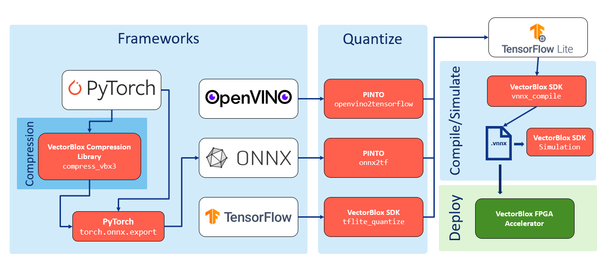

# VectorBlox SDK Programmer's Guide

This programmer’s guide provides details on the Microchip CoreVectorBlox Tool Flow environment, which is used to convert neural networks and generate graphs to accelerate inference on an FPGA using CoreVectorBlox IP.

The intended audience is software developers using Microchip CoreVectorBlox IP to accelerate neural network applications.

The programmer's guide serves as an authoritative reference for software developers working with Microchip CoreVectorBlox IP to design, develop, and optimize neural network applications.

## Table of Contents

- [Overview](#overview)
  - [Supported Operating Systems](#supported-operating-systems)
  - [Flow Diagram—SDK](#flow-diagramsdk)
- [SDK](#sdk)
  - [Setting up the Installation Environment](#setting-up-the-installation-environment)
  - [SDK Toolkits](#sdk-toolkits)
    - [OpenVINO Model Zoo and Optimizer](#openvino-model-zoo-and-optimizer)
    - [PINTO openvino2tensorflow](#pinto-openvino2tensorflow)
    - [PINTO onnx2tf](#pinto-onnx2tf)
    - [VectorBlox SDK generate_npy](#vectorblox-sdk-generate_npy)
    - [VectorBlox SDK tflite_quantize](#vectorblox-sdk-tflite_quantize)
    - [VectorBlox SDK tflite_preprocess](#vectorblox-sdk-tflite_preprocess)
    - [VectorBlox SDK tflite_postprocess](#vectorblox-sdk-tflite_postprocess)
    - [VectorBlox SDK tflite_cut](#vectorblox-sdk-tflite_cut)
  - [VBX Graph Generation (vnnx_compile)](#vbx-graph-generation-vnnx_compile)
  - [TFLite Layers](#tflite-layers)
  - [VBX Inference Simulation](#vbx-inference-simulation)
    - [C Simulation](#c-simulation)
    - [Python Simulation](#python-simulation)

## Overview

The VectorBlox™ programmer’s guide covers both the installation and use of the VectorBlox Accelerator SDK. It includes the steps needed to convert a high-level model description to a graph that runs on the CoreVectorBlox IP or on the bit-accurate simulator. This guide also covers the use of the underlying C code and API, needed to run the CoreVectorBlox IP on hardware.  

### Supported Operating Systems

Ubuntu 20.04, 22.04, and 24.04 are the current Linux® distributions that are supported.

Users who are required to use Microsoft Windows® are recommended to try out Windows Subsystem for Linux: [learn.microsoft.com/en-us/windows/wsl/install](https://learn.microsoft.com/en-us/windows/wsl/install).

The user must be aware of a few things while using Windows Subsystem for Linux:

- DNS may be broken when connected to a VPN. The VPN should be down while installing or running the VectorBlox Accelerator SDK.
- The SDK must be installed in the Linux filesystem, and not in the Windows filesystem available in /mnt/c

### Flow Diagram—SDK

The following flow diagram shows the steps of a Convolutional Neural Network (CNN) model that goes through the SDK to convert to a CoreVectorBlox graph. There are four paths in this flow depending on the model source, indicated by the white boxes in the following figure. If the model was downloaded with OpenVINO, it will go through OpenVINO's model optimizer and PINTO's openvino2tensorflow tool to generate a TFLite. If the model is an ONNX or PyTorch format, it can be converted to TF Lite using PINTO's onnx2tf tool. If the model is in TensorFlow format, it can be converted to TF Lite directly. If the model is already in quantized INT8 TF Lite format, it will enter the flow directly at the vnnx_compile step.

#### Figure 1-1. VectorBlox SDK Flow Diagram



## SDK

The SDK is available as a GitHub repository or a downloadable ZIP file containing everything needed to produce and test neural networks. The neural networks are ready for deployment on any PolarFire® FPGA with a CoreVectorBlox IP instantiated. The layout of the archive is as follows:  

```text
├── CMakeLists.txt
├── README.md
├── changelist.txt
├── demo
├── docs
├── drivers
│    └── vectorblox
├── example
│    ├── python
│    ├── sim-c
│    ├── soc-c
│    └── soc-video-c
├── install_dependencies.sh
├── libvnnx
├── patches
├── python
├── setup_vars.sh
├── snp_compiler
├── test
└── tutorials
```

### Setting up the Installation Environment

Before using the SDK, dependencies must be installed, a Python virtual environment (venv) must be created, and several environment variables must be set. To set the Python virtual environment (venv) and initialize several environment variables, perform the following steps:

1. Ensure that the user is working in an Ubuntu 20.04, 22.04, and 24.04 environment with at least Python 3.10.
2. To download the SDK, navigate to the GitHub page and click Tags to view the releases. Clone or download the zip folder for the latest tag release in a Linux directory.
3. To install the dependencies, navigate to the root folder of the SDK and run the following command:

    ```bash
    bash install_dependencies.sh
    ```

    >Note: sudo access is required to install packages.  

4. Create and activate the python3 virtual environment and set the environment variables with the following command:

    ```bash
    source setup_vars.sh
    ```

    >Note: When the user is in the VBX Python environment, the shell prompt is prefixed with (vbx_env).

5. To exit or deactivate the environment, run the following command:

    ```bash
    deactivate
    ```

    >Note: The README.md file describes these steps and examples of activating and deactivating the virtual environment.

### SDK Toolkits

The following are the four tools used in the VectorBlox flow:

- OpenVINO's model zoo and optimizer
- PINTO's openvino2tensorflow
- PINTO's onnx2tf
- VectorBlox SDK tflite_quantize, tflite_preprocess, tflite_postprocess and tflite_cut

Depending on the source of the user’s model, the user may either use some of these tools, go directly to TF Lite conversion, or go directly to VNNX graph generation.

For converting to TF Lite, users need their own NumPy array files for TF Lite calibration. Tutorials that are provided in the SDK will download the necessary NumPy calibration data. Users can leverage VectorBlox SDK's generate_npy tool to format their data into a NumPy array file.

Each VectorBlox flow tool is briefly described in the following sections, along with links to its documentation. The tools are available from the command line within the VBX Python environment.

#### OpenVINO Model Zoo and Optimizer

The OpenVINO model zoo provides access to many popular neural network models, along with key information about preprocessing and performance. It also provides a tool to download models. The following is a short description of the command usage. The full documentation is available in [OpenVINO Toolkit](https://docs.openvino.ai/2025/index.html).

- Print all models available in the model zoo.

    ```bash
    (vbx_env)~/sdk$ omz_downloader --print_all
    ```

- Download a model.

    ```bash
    (vbx_env)~/sdk$ omz_downloader --name MODEL_NAME
    ```

The OpenVINO mo command is a tool for converting and optimizing models for inference. Models from various source frameworks are converted to the OpenVINO Intermediate Representation (IR). The models are further optimized for inference by removing training-time layers, such as dropout, and applying layer fusion. The following are examples of the command’s usage. The full documentation is available in [OpenVINO Toolkit](https://docs.openvino.ai/2025/index.html).

- Convert and optimize a Caffe model without scale and mean values.

    ```bash
    (vbx_env)~/sdk$ mo –framework caffe --input_model MODEL_NAME.caffe
    ```

- Convert and optimize a Caffe model with scale and mean values.

    ```bash
    (vbx_env)~/sdk$ mo –framework caffe --input_model MODEL_NAME.caffe \
    --scale_values [127., 127., 127] --mean_values [64., 64., 64.]
    ```

**Note:** The model documentation must be reviewed to determine whether preprocessing is required or whether scale and mean values need to be included with this convert command.

#### PINTO openvino2tensorflow

PINTO's openvino2tensorflow tool converts models in the OpenVINO IR into a TF Lite model. We can use it to keep inputs as batch Number, Channels, Height, Width (NCHW) dimension order or make direct changes to parameters and layers alongside the TF Lite conversion. The following is an example of the tool's usage. More information can be found on the tool's [GitHub](https://github.com/PINTO0309/openvino2tensorflow) page.

```bash
(vbx_env)~/sdk$ openvino2tensorflow --model-path MODEL.xml --output_full_integer_quant_tflite \
--load_dest_file_path_for_the_calib_npy CALIB.npy
```

#### PINTO onnx2tf

PINTO’s onnx2tf tool converts models in ONNX format into a TF Lite model. Similar to PINTO’s openvino2tensorflow tool, it supports various arguments and provides users with flexibility in the TF Lite conversion. We can use it to maintain static input shapes or cut the ONNX graphs at designated nodes when converting to TF Lite. The following is an example of the tool’s usage. For more information, see the tool’s [GitHub](https://github.com/PINTO0309/onnx2tf) page.

```bash
(vbx_env)~/sdk$ onnx2tf --input_onnx_file_path MODEL_NAME.onnx --output_integer_quantized_tflite \
--output_signaturedefs \
--custom_input_op_name_np_data_path INPUT_OP NUMPY.npy [MEAN] [STD]
```

#### VectorBlox SDK generate_npy

```generate_npy``` generates a numpy calibration file using sample images, for tflite calibration. The image directory needs to be specified. If using dimensions other than 224 x 224 in height and width, shape needs to be specified. The following is an example of the tool's usage.

```bash
(vbx_env)~/sdk$ generate_npy sample_images/ --output_name OUTPUT_NAME --shape HEIGHT WIDTH --count 20
```

#### VectorBlox SDK tflite_quantize

If the model is based on TensorFlow, users can use the provided tflite_quantize tool in the SDK to convert it to TF Lite directly. The tool can also allow normalization based on mean and scale parameters applied to the calibration data. The following is an example of the tool’s usage.

```bash
(vbx_env)~/sdk$ tflite_quantize saved_model/ MODEL_NAME.tflite --data NUMPY.npy --mean 127.5 --scale 127.5
```

After generating a TF Lite model, the tflite_cut tool can be used to cut the graph at specific operator indices. The following is an example of the tool's usage.

```bash
(vbx_env)~/sdk$ tflite_cut MODEL_NAME.tflite -c 3 5
```

#### VectorBlox SDK tflite_preprocess

```tflite_preprocess``` adds a preprocessing layer to a TF Lite model. This is required to run models on hardware and in C, because the inputs are uint8 rather than int8 and need to be scaled.

```bash
(vbx_env)~/sdk$ tflite_preprocess MODEL_NAME.tflite -s 255 -m 127
```

#### VectorBlox SDK tflite_postprocess

```tflite_postprocess``` adds an injection layer for our demo, resizes the outputs and turns category outputs to pixel values.

```bash
(vbx_env)~/sdk$ tflite_postprocess MODEL_NAME.tflite -p PIXEL_VOC -o 0.8 --height 1080 --width 1920
```

#### VectorBlox SDK tflite_cut

If a model needs to be cut at specific nodes, the tflite_cut function can be used to cut the graph at those specific nodes. The output will then be printed out with a `*.0.tflite, *.1.tflite, *.2.tflite` and so on. The following is an example of the tool's usage.

```bash
(vbx_env)~/sdk$ tflite_cut MODEL_NAME.tflite -c
```

### VBX Graph Generation, vnnx_compile

This section describes the process of converting the TF Lite model generated from the commands in the sdk toolkit into a binary file. The vnnx_compile command is available from the command line within the VBX Python environment. For more details on compression and size configurations, please refer to the CoreVectorBlox v3.0 IP Handbook.

You may embed a test image in the model to quickly test inference and post-processing with the following command:

```vnnx_compile  -s  SIZE_CONFIG  -c COMPRESSION_CONFIG  -t  MODEL_NAME.tflite  -i  IMAGE_NAME.jpg```

The TF Lite model is processed by the VectorBlox binary file generation tool, which produces a quantized binary file that runs on both hardware and the simulator. To use the tool, provide the input TF Lite model and hardware size configuration (V250, V500, or V1000). If you use custom pre-processing or post-processing code, you can specify the starting and ending nodes for the VNNX graph. By default, tutorials use V1000 with no compression.

Display usage:

```text
usage: vnnx_compile [-h] -t TFLITE -s {V250,V500,V1000} -c {ncomp,comp,ucomp} [-o OUTPUT] [--start_layer START_LAYER] [-e END_LAYER] [-i [INPUTS ...]] [-m MEAN [MEAN ...]] [-sc SCALE [SCALE ...]] [-b] [-u]

options:
  -h, --help            show this help message and exit
  -t TFLITE, --tflite TFLITE
                        tflite I8 model description (.tflite)
  -s {V250,V500,V1000}, --size_conf {V250,V500,V1000}
                        size configuration to build model for
  -c {ncomp,comp,ucomp}, --compression-vbx {ncomp,comp,ucomp}
                        compression setting for VNNX model generation
  -o OUTPUT, --output OUTPUT
                        Name of vnnx output file
  --start_layer START_LAYER
  -e END_LAYER, --end_layer END_LAYER
  -i [INPUTS ...], --inputs [INPUTS ...]
                        provide test inputs for model
  -m MEAN [MEAN ...], --mean MEAN [MEAN ...]
  -sc SCALE [SCALE ...], --scale SCALE [SCALE ...]
  -b, --bgr
  -u, --uint8 
            uint8 can only be used with the ucomp compression config
```

#### No Compression

The following example shows how to generate a binary file from a TF Lite model for the V1000 with the no compression configuration:

```vnnx_compile  -s  V1000  -c ncomp  -t  MODEL_NAME.tflite```

The binary output file name for V1000 with no compression will be ```MODEL_NAME_ V1000_ncomp.vnnx```

#### Compression

The following example shows how to generate a binary file from a TF Lite model for the V1000 with the compression configuration:

```vnnx_compile  -s  V1000  -c comp  -t  MODEL_NAME.tflite```

The binary output file name for V1000 with compression will be ```MODEL_NAME_V1000_comp.vnnx```

#### Unstructured Compression

For unstructured compression, V1000 is the only supported size configuration. Provide the input TF Lite model with -t; pass the --uint8 flag to convert to signed int8 if needed; and use```-c ucomp``` to specify unstructured compression.

**Note:** The --uint8 flag can only be used when generating a binary file with unstructured compression.

The following example demonstrates how to generate a binary file from a TF Lite model for the V1000 and unstructured compression configuration:

```vnnx_compile -s  V1000 -c ucomp  -t  MODEL_NAME.tflite  --uint8```

The binary output file name for V1000 with compression will be ```MODEL_NAME.ucomp```

### TFLite Layers

VectorBlox aims to support all TFLITE INT8 layers described in the [TFLite INT8 quantization spec](https://ai.google.dev/edge/litert/conversion/tensorflow/quantization/quantization_spec#int8_quantized_operator_specifications).

For the list of currently supported operators and their restrictions, see the [OPS.md file](./OPS.md).

### VBX Inference Simulation

Refer to the sections above for instructions on creating a binary file that is ready to run on the functionally accurate VBX simulator. Example scripts that call the simulator and run post-processing are provided for classification and object detection tasks. For more details on simulator use and post-processing, see the subsequent sections of this guide.

#### C Simulation

The following script runs the C version of the simulator and prints the model's checksum based on either a sample image (.JPG) or the default test_data if no sample image is provided.

```bash
(vbx_env) ~/sdk$ $VBX_SDK/example/sim-c/sim-run-model MODEL_NAME.vnnx IMAGE.jpg POSTPROCESSTYPE
```

#### Python Simulation

The following scripts run the indicated models with the Python version of the simulator and print the inference results. They also generate an annotated output image.

Arguments passed for the following Python commands are found/explained in their corresponding Python files.

This is a list of a few examples; for exact details on which Python commands to run for specific models, refer to the [tutorials](../tutorials).

- Run a classifier model on the simulator.

```bash
(vbx_env) ~/sdk$ python $VBX_SDK/example/python/classifier.py MODEL_NAME.vnnx IMAGE.jpg
```

- Run a YOLO model (for example, YOLOv5n) on the simulator.

```bash
(vbx_env) ~/sdk$ python $VBX_SDK/example/python/yoloInfer.py yolov5n_V1000_ncomp.vnnx IMAGE.jpg -j yolov5n.json -v 5 -l coco.names -t 0.25 
```

- Run a YOLOv8 model (for example, yolov8n) on the simulator.

```bash
(vbx_env) ~/sdk$ python $VBX_SDK/example/python/yoloInfer.py yolov8n_V1000_ncomp.vnnx IMAGE.jpg --v 8 -l coco.names 
```

- Run a pose detection model (for example, PoseNet) on the simulator.

```bash
(vbx_env) ~/sdk$ python $VBX_SDK/example/python/posenetInfer.py posenet_V1000_ncomp.vnnx -i IMAGE.jpg 
```
