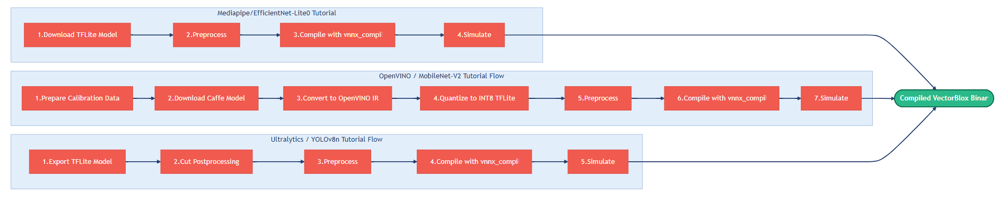

# VectorBlox Tutorial Walkthrough Guide

This guide walks through three VectorBlox SDK tutorials that convert models from their source framework into a compiled binary file suitable for the PolarFire FPGA. Note that these three walkthroughs are just examples, and other models will likely require slightly different steps to generate a binary file.

## Table of Contents

- [Tutorials Covered](#tutorials-covered)
- [Common Tutorial Pattern](#common-tutorial-pattern)
- [Walkthrough for mediapipe/efficientnet\_lite0](#walkthrough-for-mediapipeefficientnet_lite0)
  - [Step 1 — Download efficientnet\_lite0.tflite](#step-1--download-efficientnet_lite0tflite)
  - [Step 2 — Preprocess](#step-2--preprocess)
  - [Step 3 — Compile with vnnx\_compile](#step-3--compile-with-vnnx_compile)
  - [Step 4 — Simulate](#step-4--simulate)
- [Walkthrough for openvino/mobilenet-v2](#walkthrough-for-openvinomobilenet-v2)
  - [Step 1 — Prepare calibration data](#step-1--prepare-calibration-data)
  - [Step 2 — Download the Caffe model](#step-2--download-the-caffe-model)
  - [Step 3 — Convert to OpenVINO IR with Model Optimizer](#step-3--convert-to-openvino-ir-with-model-optimizer)
  - [Step 4 — Convert to quantized INT8 TFLite](#step-4--convert-to-quantized-int8-tflite)
  - [Step 5 — Preprocess](#step-5--preprocess)
  - [Step 6 — Compile with vnnx\_compile](#step-6--compile-with-vnnx_compile)
  - [Step 7 — Simulate](#step-7--simulate)
- [Walkthrough for ultralytics/yolov8n](#walkthrough-for-ultralyticsyolov8n)
  - [Step 1 — Export quantized TFLite from Ultralytics](#step-1--export-quantized-tflite-from-ultralytics)
  - [Step 2 — Cut Postprocessing with tflite\_cut](#step-2--cut-postprocessing-with-tflite_cut)
  - [Step 3 — Preprocess](#step-3--preprocess)
  - [Step 4 — Compile with vnnx\_compile](#step-4--compile-with-vnnx_compile)
  - [Step 5 — Simulate](#step-5--simulate)

## Tutorials Covered

1. `mediapipe/efficientnet_lite0` — Image classification model; comes pre-quantized, so no further quantization is required
2. `openvino/mobilenet-v2` — Image classification, requires OpenVINO model conversion and quantization
3. `ultralytics/yolov8n` — Object detection, requires graph trimming before compilation

#### Covered Tutorials Workflow Diagram



## Common Tutorial Pattern

Most tutorials for classification and detection follow this flow:

1. **Get a model** (download/export)
2. **(Optional) Quantize** to INT8 (if not already an INT8 TFLite)
3. **Preprocess** the `.tflite` for VectorBlox (`tflite_preprocess`)
4. **Compile** to binary (`.vnnx`) with `vnnx_compile`
5. **Simulate** (Python or C simulation)

---

## Walkthrough for mediapipe/efficientnet_lite0

EfficientNet-Lite0 is a lightweight image classifier from Google's MediaPipe. This tutorial is the simplest path through the SDK since the model is already quantized to INT8 by MediaPipe, so it enters the pipeline at the tflite preprocess step.

### Step 1 — Download efficientnet_lite0.tflite

```bash
wget -q --no-check-certificate https://storage.googleapis.com/mediapipe-models/image_classifier/efficientnet_lite0/int8/latest/efficientnet_lite0.tflite
```

The model is downloaded directly from Google's MediaPipe model repository as a pre-quantized INT8 TFLite file. **Because MediaPipe publishes models already in quantized INT8 TFLite format, the quantization step is skipped entirely**.

### Step 2 — Preprocess

```bash
tflite_preprocess efficientnet_lite0.tflite --scale 255
```

`tflite_preprocess` injects normalization operations at the beginning of the TFLite graph and writes the result to `efficientnet_lite0.pre.tflite`.

The `--scale 255` argument means the inserted layer will divide input pixel values by 255. This is done by the Multiply operator `MUL`, which multiplies by 0.00392. Layers inserted by tflite_preprocess can be seen when inspecting the model's graph in [Netron](https://netron.app/).

Also, this step adds a `Quantize` layer for converting from uint8 to int8.

Output file: `efficientnet_lite0.pre.tflite`

### Step 3 — Compile with vnnx_compile

```bash
vnnx_compile -s V1000 -c ncomp -t efficientnet_lite0.pre.tflite -o efficientnet_lite0_V1000_ncomp.vnnx
```

`vnnx_compile` is the compilation step that converts the INT8 TFLite graph into a VectorBlox binary (`.vnnx`) or (`.ucomp` for unstructured compression) that can be executed on physical hardware. A (`.hex`) file will also be output that can be used with the Non SoC demo.  

The `-s V1000` flag selects the V1000 hardware size configuration, and `-c ncomp` selects the `no compression` configuration.

Output files: `efficientnet_lite0_V1000_ncomp.vnnx`, `efficientnet_lite0_V1000_ncomp.hex`

### Step 4 — Simulate

```bash
# efficientnet_lite0 Python Simulation Command:
python $VBX_SDK/example/python/classifier.py efficientnet_lite0_V1000_ncomp.vnnx $VBX_SDK/tutorials/test_images/oreo.jpg

# efficientnet_lite0 C Simulation Command:
$VBX_SDK/example/sim-c/sim-run-model efficientnet_lite0_V1000_ncomp.vnnx $VBX_SDK/tutorials/test_images/oreo.jpg CLASSIFY
```

`classifier.py` runs inference through the VectorBlox Python simulator.

The C simulation command shown (using `sim-run-model`) is useful for verifying that the model will run on hardware.

---

## Walkthrough for openvino/mobilenet-v2

MobileNet-v2 is an image classifier published in OpenVINO's model zoo in Caffe format. This tutorial demonstrates the full conversion path for a non-quantized, non-TFLite model.

### Step 1 — Prepare calibration data

```bash
    generate_npy $VBX_SDK/tutorials/imagenetv2_rgb_20x224x224x3.npy \
        -o $VBX_SDK/tutorials/imagenetv2_20x224x224x3.npy \
        -s 224 224 -b
```

Post-training quantization (converting a float32 or float16 model to INT8) requires a representative sample of real input data called a **calibration dataset**.  

The SDK comes with a pre-collected calibration dataset `imagenetv2_rgb_20x224x224x3.npy`  

`generate_npy` reformats this array for use with `openvino2tensorflow`. The `-b` flag converts from RGB to BGR channel order, since OpenVINO is BGR. The reformatted result is saved to `imagenetv2_20x224x224x3.npy`.

### Step 2 — Download the Caffe model

```bash
omz_downloader --name mobilenet-v2
```

`omz_downloader` is the [OpenVINO Model Zoo](https://github.com/openvinotoolkit/open_model_zoo/tree/2021.4.2/models/public/mobilenet-v2) downloader. It downloads the MobileNet-v2 model in its original Caffe format (`.caffemodel` + `.prototxt`) from Intel's model repository and saves it to `public/mobilenet-v2/`.

### Step 3 — Convert to OpenVINO IR with Model Optimizer

```bash
   mo --input_model public/mobilenet-v2/mobilenet-v2.caffemodel \
      --mean_values [103.94,116.78,123.68] \
      --reverse_input_channels \
      --scale_values [58.82] \
      --static_shape \
      --input_shape [1,3,224,224]
```

The OpenVINO Model Optimizer (`mo`) is an external tool that converts the Caffe model into OpenVINO's Intermediate Representation (IR) format — a pair of `.xml` (graph structure) and `.bin` (weights) files. This is a required step because `openvino2tensorflow` (used in the next step) consumes OpenVINO IR, and not Caffe models.

### Step 4 — Convert to quantized INT8 TFLite

```bash
   openvino2tensorflow \
      --load_dest_file_path_for_the_calib_npy $VBX_SDK/tutorials/imagenetv2_20x224x224x3.npy \
      --model_path mobilenet-v2.xml \
      --output_full_integer_quant_tflite \
      --string_formulas_for_normalization '(data - [0.,0.,0.]) / [1.,1.,1.]'
   cp saved_model/model_full_integer_quant.tflite mobilenet-v2.tflite
```

`openvino2tensorflow` converts the OpenVINO IR model to the TensorFlow SavedModel format and then applies full-integer post-training quantization to produce an INT8 TFLite file. This step takes the model from FP32 to INT8.

Flags to notice:

- `--load_dest_file_path_for_the_calib_npy` — points to the calibration dataset prepared in Step 1.  
- `--output_full_integer_quant_tflite` — requests full integer quantization where all ops, including inputs and outputs, are quantized to INT8.
- `--string_formulas_for_normalization '(data - [0.,0.,0.]) / [1.,1.,1.]'` — this is an identity normalization (mean=0, scale=1) because all normalization was already done earlier in the `mo` step.  

The quantized TFLite is saved to `saved_model/model_full_integer_quant.tflite` and then copied to `mobilenet-v2.tflite`.

### Step 5 — Preprocess

```bash
   tflite_preprocess mobilenet-v2.tflite
```

`tflite_preprocess` is called here without a `--scale` argument (defaulting to `scale=1.0`, `mean=0.0`), which means no MUL or ADD normalization ops are injected.

In this case, `tflite_preprocess` only inserts a `Quantize` op at the model input, converting the graph's input tensor type from `INT8` (which TFLite full-integer quantization produces) to `uint8`. The normalization was already handled in Step 3 with the `mo` command.

For the compile and simulate steps, refer to the EfficientNet-Lite0 tutorial above, as they follow the same pattern.

Output file: `mobilenet-v2.pre.tflite`

### Step 6 — Compile with vnnx_compile

```bash
    vnnx_compile -s V1000 -c ncomp -t mobilenet-v2.pre.tflite  -o mobilenet-v2_V1000_ncomp.vnnx
```

Output files: `mobilenet-v2_V1000_ncomp.vnnx`, `mobilenet-v2_V1000_ncomp.hex`

Refer to step 3 of the mediapipe/efficientnet_lite0 tutorial for more information.

### Step 7 — Simulate

```bash
    # mobilenet-v2 Python Simulation Command:
    python $VBX_SDK/example/python/classifier.py mobilenet-v2_V1000_ncomp.vnnx $VBX_SDK/tutorials/test_images/oreo.jpg

    # mobilenet-v2 C Simulation Command:
    $VBX_SDK/example/sim-c/sim-run-model mobilenet-v2_V1000_ncomp.vnnx $VBX_SDK/tutorials/test_images/oreo.jpg CLASSIFY

```
Refer to step 4 of the mediapipe/efficientnet_lite0 tutorial for more information.

---

## Walkthrough for ultralytics/yolov8n

YOLOv8n (Nano) from Ultralytics is designed for object detection with 80 COCO classes. The key difference in this tutorial is that the postprocessing is cut from the graph, and VectorBlox's own post-processing is used to improve performance and accuracy.

### Step 1 — Export quantized TFLite from Ultralytics

```bash
    [ -f coco.names ] || wget -q https://raw.githubusercontent.com/pjreddie/darknet/master/data/coco.names
    yolo export model=yolov8n.pt format=tflite int8 || true
    cp yolov8n_saved_model/yolov8n_full_integer_quant.tflite yolov8n.tflite
```

The `coco.names` file contains the 80 COCO class label strings (person, bicycle, car, etc.) and is downloaded from Darknet’s repository. It is used during simulation inference.

`yolo export` is the Ultralytics command that:

1. Downloads `yolov8n.pt` from Ultralytics, which comes in FP16 format
2. Runs the model on a representative calibration dataset drawn from the COCO training set to compute INT8 quantization
3. Exports the quantized model as a TFLite SavedModel in `yolov8n_saved_model/`, with the full-integer quantized file at `yolov8n_saved_model/yolov8n_full_integer_quant.tflite`, which is then copied into `yolov8n.tflite`


### Step 2 — Cut Postprocessing with tflite_cut

```bash
   tflite_cut yolov8n.tflite -c 189 196 206 213 223 230
   mv yolov8n.0.tflite yolov8n.cut.tflite
```

`tflite_cut` cuts the TFLite graph at the specified nodes and writes each partition as a separate, numbered `.tflite` file.

The indices 189, 196, 206, 213, 223, and 230 mark the boundaries between the main portion of the graph (the convolutional feature extraction portion) and the postprocessing section (which we handle with our own postprocessing code).

`tflite_cut` outputs:

- `yolov8n.0.tflite` — the main portion of the graph, which is the part that runs on VectorBlox. This is renamed to `yolov8n.cut.tflite`.
- The other subgraphs are discarded

**Note:** Tutorials with "FULL" in the name (e.g., yolov8n_FULL) are the same model without this cut step (postprocessing remains in the graph).

### Step 3 — Preprocess

```bash
   tflite_preprocess yolov8n.cut.tflite --scale 255
```

Same flow as the EfficientNet tutorial from this point on. As mentioned earlier, `tflite_preprocess --scale 255` injects a normalization layer at the model input.

Output file: `yolov8n.cut.pre.tflite`

### Step 4 — Compile with vnnx_compile

```bash
    vnnx_compile -s V1000 -c ncomp -t yolov8n.cut.pre.tflite -o yolov8n_V1000_ncomp.vnnx
```

Output files: `yolov8n_V1000_ncomp.vnnx`, `yolov8n_V1000_ncomp.hex`

Refer to step 3 of the mediapipe/efficientnet_lite0 tutorial for more information.

### Step 5 — Simulate

```bash
    # yolov8n Python Simulation Command:
    python $VBX_SDK/example/python/yoloInfer.py yolov8n_V1000_ncomp.vnnx $VBX_SDK/tutorials/test_images/dog.jpg -v 8 -l coco.names

    # yolov8n C Simulation Command:
    $VBX_SDK/example/sim-c/sim-run-model yolov8n_V1000_ncomp.vnnx $VBX_SDK/tutorials/test_images/dog.jpg OBJECT_DETECT
```

Refer to step 4 of the mediapipe/efficientnet_lite0 tutorial for more information.

