# Tutorials

This directory contains end-to-end tutorials that show how to generate a binary file for a specific model using the VectorBlox SDK. Tutorials are organized by model source. For a detailed breakdown of three of our tutorials, please refer to the [Tutorial Walkthrough Guide](../docs/tutorial_walkthrough_guide.md).

## Tutorials Overview

Each tutorial includes a shell script that demonstrates the complete pipeline:

```mermaid
%%{init: {
  'flowchart': {'curve':'linear', 'nodeSpacing':40, 'rankSpacing':65, 'padding':30, 'defaultRenderer':'elk'},
  'theme':'base',
  'themeVariables': {
    'background':'#ffffff',
    'fontFamily':'system-ui, -apple-system, "Segoe UI", Roboto, Helvetica, Arial, sans-serif',
    'fontSize':'20px',
    'primaryColor':'#ffffff',
    'primaryTextColor':'#1a2533',
    'lineColor':'#334155'
  }
}}%%
flowchart LR
    Start(["Download Source Model"])
    Decision{"Source Format?"}

    subgraph Convert["Convert to INT8 TFLite"]
        direction TB
        OpenVINO["openvino2tensorflow"]
        ONNX["onnx2tf"]
        TFQuant["tflite_quantize<br/>"]
    end

    TFLite["INT8 TFLite Model"]
    Preprocess["tflite_preprocess<br/>"]
    PreTFLite[".pre.tflite"]
    Compile["vnnx_compile"]
    Vnnx["Model Binary File (.vnnx or .ucomp)"]
    Simulate["Python Simulation<br/>"]
    Deploy(["Deploy Model Binary File<br/>to Target Hardware"])

    Start --> Decision
    Decision -->|"OpenVINO IR"| OpenVINO
    Decision -->|"ONNX"| ONNX
    Decision -->|"FP32 TF / Keras"| TFQuant
    Decision -->|"Already INT8 TFLite"| TFLite

    OpenVINO --> TFLite
    ONNX --> TFLite
    TFQuant --> TFLite

    TFLite --> Preprocess
    Preprocess --> PreTFLite
    PreTFLite --> Compile
    Compile --> Vnnx
    Vnnx --> Simulate
    Simulate --> Deploy

    classDef startEnd fill:#ffffff,stroke:#64748b,stroke-width:2.5px,color:#1a2533
    classDef tool fill:#e0e7ff,stroke:#4f46e5,stroke-width:2px,color:#1e1b4b
    classDef decision fill:#fff6d6,stroke:#d4a84b,stroke-width:2px,color:#5a4210
    classDef artifact fill:#ffffff,stroke:#64748b,stroke-width:2px,color:#1a2533
    classDef hw fill:#5cb85c,stroke:#2e7a2e,stroke-width:2.5px,color:#ffffff

    class Start startEnd
    class OpenVINO,ONNX,TFQuant,Preprocess,Compile,Simulate tool
    class Decision decision
    class TFLite,PreTFLite,Vnnx artifact
    class Deploy hw

    style Convert fill:#f8fafc,stroke:#94a3b8,stroke-width:2px,stroke-dasharray:6 6,color:#475569

    linkStyle default stroke:#334155,stroke-width:2.5px
```



1. Download the source model.
2. Convert the model to TensorFlow Lite (if needed) using one of the following: openvino2tensorflow, onnx2tf, or tflite_quantize.
3. Run `tflite_preprocess` to add a preprocessing layer before generating the binary.
4. Generate the binary with VectorBlox's graph generation tool: `vnnx_compile`.
5. Simulate and run inference using the Python script in `example/python` with the provided test image.

These scripts illustrate the complete pipeline for generating a model's binary file. Users may use or modify these scripts to generate a binary file for their own custom model, tailored to their use cases.

To run a tutorial script, change into the model's tutorial directory and run:

```bash
(vbx_env) ~/SDK/VectorBlox-SDK/tutorials/SOURCE_NAME/MODEL_NAME$ bash MODEL_NAME.sh
```

## Tutorial Metrics

- Runtime in milliseconds (ms) measured on [SoC Video Kit](https://github.com/Microchip-Vectorblox/VectorBlox-SoC-Video-Kit-Demo). Accuracy is measured over 1000 samples.
- **For a complete list of metrics for every VectorBlox tutorial, please visit the [Tutorial Metrics Appendix Markdown Page](../docs/tutorial_metrics_appendix.md) in the docs folder.**

## No Compression (subset)

| Source | Tutorial | Input<br>(H,W,C) | Runtime<br>(ms) | Task | Metric | TFLITE | VNNX |
|:---:|:---:|:---:|:---:|:---:|:---:|:---:|:---:|
| PINTO | [081_MiDaS_v2](PINTO/081_MiDaS_v2/081_MiDaS_v2.sh) | [256, 256, 3] | 121.921 | depth estimation | depthdelta1 (nyuv2) | 60.89 | 59.93 |
| kaggle | [efficientnet-lite0](kaggle/efficientnet-lite0/efficientnet-lite0.sh) | [224, 224, 3] | 16.481 | classification | Top1 | 70.8 | 70.4 |
| onnx | [onnx_resnet18-v1](onnx/onnx_resnet18-v1/onnx_resnet18-v1.sh) | [224, 224, 3] | 25.741 | classification | Top1 | 69.1 | 68.9 |
| openvino | [mobilenet-v1-1.0-224](openvino/mobilenet-v1-1.0-224/mobilenet-v1-1.0-224.sh) | [224, 224, 3] | 11.811 | classification | Top1 | 70.1 | 70.1 |
| qualcomm | [FFNet-122NS-LowRes_512x288](qualcomm/FFNet-122NS-LowRes_512x288/FFNet-122NS-LowRes_512x288.sh) | [288, 512, 3] | 76.168 | segmentation | meanIoU (cityscapes) | 44.82 | 44.45 |
| qualcomm | [MobileNet-v3-Large-Quantized](qualcomm/MobileNet-v3-Large-Quantized/MobileNet-v3-Large-Quantized.sh) | [224, 224, 3] | 22.895 | classification | Top1 | 69.6 | 68.8 |
| qualcomm | [QuickSRNetMedium-Quantized](qualcomm/QuickSRNetMedium-Quantized/QuickSRNetMedium-Quantized.sh) | [128, 128, 3] | 9.353 | image enhancement | PSNR (bsd300) | 26.79 | 26.81 |
| tensorflow | [mobilenet_v2](tensorflow/mobilenet_v2/mobilenet_v2.sh) | [224, 224, 3] | 12.875 | classification | Top1 | 70.2 | 70.1 |
| ultralytics | [yolov5n](ultralytics/yolov5n/yolov5n.sh) | [640, 640, 3] | 38.817 | object detection | mAP⁵⁰⁻⁹⁵ | 22.88 | 22.95 |
| ultralytics | [yolov8n](ultralytics/yolov8n/yolov8n.sh) | [640, 640, 3] | 54.129 | object detection | mAP⁵⁰⁻⁹⁵ | 37.4 | 37.38 |
| ultralytics | [yolov8n-cls](ultralytics/yolov8n-cls/yolov8n-cls.sh) | [224, 224, 3] | 4.104 | classification | Top1 | 67.2 | 67.3 |
| ultralytics | [yolov8n-obb](ultralytics/yolov8n-obb/yolov8n-obb.sh) | [1024, 1024, 3] | 142.268 | obb detection | mAP⁵⁰⁻⁹⁵ |  |  |
| ultralytics | [yolov8n-pose_512x288_split](ultralytics/yolov8n-pose_512x288_split/yolov8n-pose_512x288_split.sh) | [288, 512, 3] | 21.998 | pose detection | Pose Detection |  |  |
| ultralytics | [yolov8n-seg](ultralytics/yolov8n-seg/yolov8n-seg.sh) | [640, 640, 3] | 70.769 | instance segmentation |  |  |  |
| ultralytics | [yolov9t](ultralytics/yolov9t/yolov9t.sh) | [640, 640, 3] | 65.068 | object detection | mAP⁵⁰⁻⁹⁵ | 37.92 | 38.18 |


## Compression

| Source | Tutorial | Input<br>(H,W,C) | Runtime<br>(ms) | Task | Metric | TFLITE | VNNX |
|:---:|:---:|:---:|:---:|:---:|:---:|:---:|:---:|
| compressed | [yolov8n_comp66](compressed/yolov8n_comp66/yolov8n_comp66.sh) | [640, 640, 3] | 35.85 | object detection | mAP⁵⁰⁻⁹⁵ | 37.18 | 37.3 |
| compressed | [yolov8s_comp68](compressed/yolov8s_comp68/yolov8s_comp68.sh) | [640, 640, 3] | 90.812 | object detection | mAP⁵⁰⁻⁹⁵ | 46.11 | 46.15 |


## Unstructured Compression

| Source | Tutorial | Input<br>(H,W,C) | Runtime<br>(ms) | Task | Metric | TFLITE |
|:---:|:---:|:---:|:---:|:---:|:---:|:---:|
| unstructure_compressed | [resnet18_86s_07p](unstructure_compressed/resnet18_86s_07p/resnet18_86s_07p.sh) | [224, 224, 3] | 14.63 | classification | Top1 | 65.6 |
| unstructure_compressed | [yolov5n_70s_512x512](unstructure_compressed/yolov5n_70s_512x512/yolov5n_70s_512x512.sh) | [512, 512, 3] | 19.779 | object detection | mAP⁵⁰⁻⁹⁵ | 20.2 |
| unstructure_compressed | [yolov8n_50s_25p_512x288](unstructure_compressed/yolov8n_50s_25p_512x288/yolov8n_50s_25p_512x288.sh) | [288, 512, 3] | 15.428 | object detection | mAP⁵⁰⁻⁹⁵ | 34.6 |
| unstructure_compressed | [yolov8n_50s_25p_512x512](unstructure_compressed/yolov8n_50s_25p_512x512/yolov8n_50s_25p_512x512.sh) | [512, 512, 3] | 25.265 | object detection | mAP⁵⁰⁻⁹⁵ |  |
| unstructure_compressed | [yolov8n_pose_50s_25p_512x288_split](unstructure_compressed/yolov8n_pose_50s_25p_512x288_split/yolov8n_pose_50s_25p_512x288_split.sh) | [288, 512, 3] | 15.507 | pose detection |  |  |
| unstructure_compressed | [yolov9s_70s_15p_512x288](unstructure_compressed/yolov9s_70s_15p_512x288/yolov9s_70s_15p_512x288.sh) | [288, 512, 3] | 32.95 | object detection |  | 43.2 |
| unstructure_compressed | [yolov9s_70s_15p_512x512](unstructure_compressed/yolov9s_70s_15p_512x512/yolov9s_70s_15p_512x512.sh) | [512, 512, 3] | 55.576 | object detection |  |  |